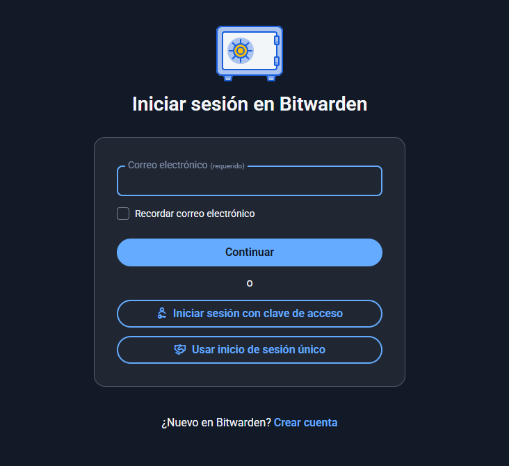
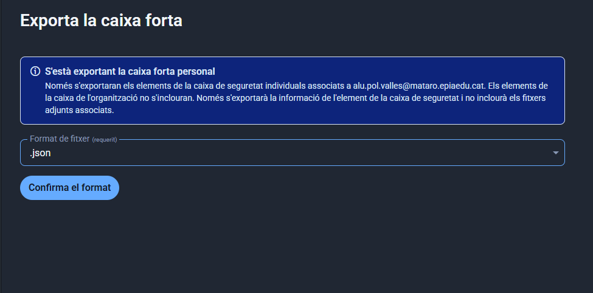

# Fase 2: Guia d'Ús Tècnica de Bitwarden per a l'Equip Tècnic

**Introducció**
Aquesta guia està dissenyada per a que l'equip tècnic pugui gestionar les contrasenyes de manera segura utilitzant la versió web de Bitwarden. Aquesta eina te complements com extensions web i també pot ser usada des d'aplicacions d'escriptori.

---

**Accés i inici de sessió a la web**

1. **Accés a l’eina:**
   - Obriu el navegador i aneu a [Bitwarden Web](https://vault.bitwarden.com).
   
2. **Iniciar sessió:**
   - Introduïu el vostre correu electrònic i la contrasenya mestre.
   - Feu clic a "Iniciar sessió".

 

  

---

**Funcionament amb la web i opcions addicionals**

Des de la interface web, podeu:

- **Afegir noves credencials:** cliqueu a "Afegeix un element" i trieu "Inici de sessió". Ompliu els camps amb la URL, usuari i contrasenya, que podeu generar a la mateixa eina. [Imatge de suport](img/crearIniciSessio.png)
- **Editar o eliminar credencials:** simplement seleccionant l’entrada i fent clic a editar o eliminar. [Imatge de suport](img/modificar_credencials.png)

**Generació de contrasenyes segures**

- Des del web, cliqueu a "Generador de contrasenyes".
- Configureu la longitud i els paràmetres (majúscules, minúscules, números i caràcters especials).
- Copieu la contrasenya i deseu-la dins la vostra credencial.
- [Imatge de suport](img/generador_contrasenya.png)

**Afegir credencials i emplenar automàticament**

- A l’extensió del navegador, quan visitis una pàgina de login, Bitwarden proposarà emplenar automàticament la informació.
- També podeu crear, veure i copiar credencials des de la interfície web si cal.
- [Imatge de suport](img/modificar_credencials.png)

 

  

---

**Gestió de Còpies de Seguretat (Backup)**

1. **Exportació de dades:**
   - A la web, entreu a "Configuració" > "Exportar bóveda".
   - Seleccioneu el format (preferentment xifrat) i feu l’exportació.
   - Guardeu la còpia en un dispositiu segur.

2. **Emmagatzematge segur:**
   - Conserveu la còpia en una clau USB xifrada o en un servei de núvol amb xifratge i control d’accés.
   - No deixeu còpies sense protecció ni en llocs accessibles públicament.

 

  

---

## Resum
Pots gestionar de manera segura i còmoda les contrasenyes amb la web de Bitwarden, i ampliar les funcionalitats amb la instal·lació de la aplicació d’escriptori o la extensió del navegador per a un millor emmagatzematge, emplenament automàtic i generació de contrasenyes robustes.

---

**Nota:** Assegureu-vos que cada captura de pantalla sigui clara i visible, i que s’incorpori a la carpeta `img/`. Sigui com sigui, aquestes imatges es poden obtenir fent captures de pantalla del vostre entorn amb els passos indicats.

🔙 [Tornar a la tasca](README.md)  
📍 [Tornar a la pàgina del projecte](../../README.md)
