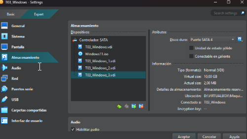
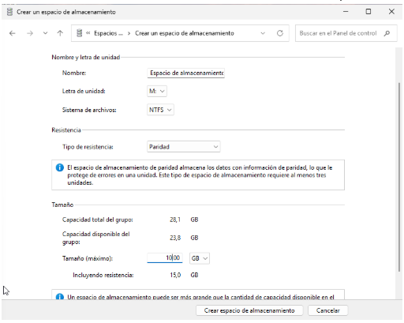
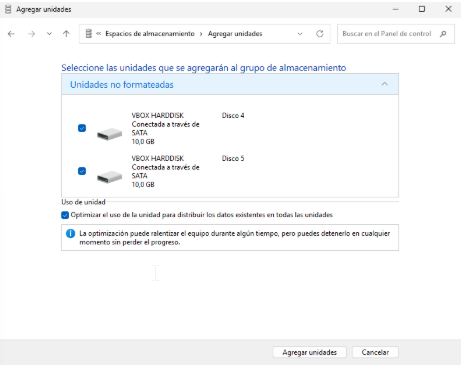

# Part Windows: Espais d'Emmagatzematge (Storage Spaces)

S'ha d'utilitzar Windows 11 (per demostrar les configuracions possibles mitjançant els Espais d'Emmagatzematge (Storage Spaces).

Requisits de la Implementació i Demostració:
- Configuració inicial: Creació d'un Storage Pool: Crear un pool d'emmagatzematge inicialment amb tres discos de 10 GB (simulats).
- Estudi de Configuracions: Demostrar i documentar la creació d'un Espai d'Emmagatzematge utilitzant:
- Resiliència de Mirall (Mirroring): Usar dos dels discos. Comprovar que ofereix alta disponibilitat.
  - Mirall triple: desfer l’espai anterior i crear un amb els tres discos que sigui mirall triple. Justificar quins avantatges té respecte el mirroring.
  - Resiliència de Paritat (Parity): Explicant la seva eficiència d'espai en comparació amb el mirall. Afegir tant discos de 10 GB com siguin necessaris.
- Demostració de la Gestió: Mostrar com es visualitza l'estat dels discos i del pool des de la consola de gestió de Windows, simulant la facilitat de manteniment.

**Configuració inicial:**
En primer lloc, es crea un pool d’emmagatzematge inicial format per tres discos virtuals de 10 GB cadascun.

A partir d’aquesta base, s’analitzen i documenten diversos tipus de configuracions d’espais d’emmagatzematge amb diferents nivells de resiliència.

### Administrar discos
Seguidament administrarem els discos de 10 GB simulats 1,2 i 3 que prèviament hem creat. Usarem el següent disc de partició per els discos seleccionats “MBR (Registre d’arrencada mestre).

### Resiliència de Paritat
A continuació, es crea un nou espai d’emmagatzematge amb resiliència de paritat, afegint-hi una nova unitat VBOX HARDDISK de 10 GB per millorar la distribució de les dades dins del grup.
Aquest tipus d’espai ofereix una major eficiència d’emmagatzematge en comparació amb el mirall, ja que només una part de la capacitat total es destina a la informació de paritat, mentre que la resta s’utilitza per a dades útils.
És una opció adequada per a entorns on es prioritza la capacitat disponible sobre la velocitat d’escriptura.

### Resiliència de mirall triple
Un cop demostrada la configuració anterior, es desfà l’espai creat i se’n genera un de nou amb resiliència de mirall triple, utilitzant els tres discos de 10 GB.

Avantatges respecte al mirroring doble:
- Major nivell de protecció, ja que les dades es repliquen tres vegades.
- Possibilitat de resistir la fallada simultània de fins a dos discos sense pèrdua d’informació.
- Millor seguretat en entorns on la disponibilitat i la integritat de les dades són crítiques.

👉 [Tornar a la pàguina de la tasca](README.md)
🔥 [Tornar a la pàguina del projecte](../../README.md)
