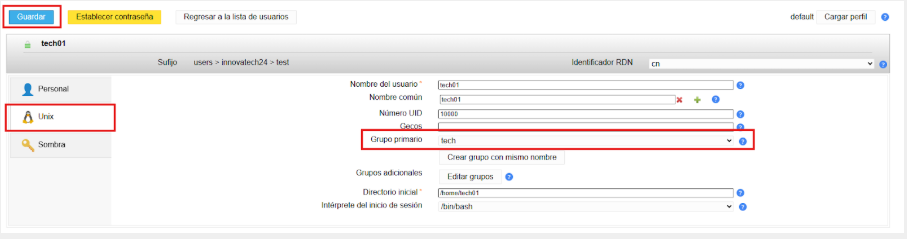

# Tasques d'Implementació i Configuració del Servidor LDA

| ID       | Descripció de la Tasca                        | Detalls de la Configuració                                                                                          | Imatge                       |
| -------- | --------------------------------------------- | ------------------------------------------------------------------------------------------------------------------- | ---------------------------- |
| T.LAM.01 | Instal·lació del Gestor d'Usuaris LDAP (LAM). | S'ha de documentar la comanda d'instal·lació.                                                                       | 
| T.LAM.02 | Accés Remot i Configuració.                   | Connectar a LAM des de la màquina física utilitzant l'adreça IP de la interfícieHost-Only.                          | 
| T.LAM.03 | Configuració per defecte.                     | Establir la configuració predeterminada perquè els nous usuaris s'ubiquin a l'OUusersi els nous grups a l'OUgroups. | 
| T.LAM.04 | Creació de Grups.                             | Crear dos grups de seguretat al directori:techimanager.                                                             |  
| T.LAM.05 | Creació d'Usuaris de Prova.                   | Crear un usuari per a cada grup:tech01(membre detech) imanager01(membre demanager).                                 | 
