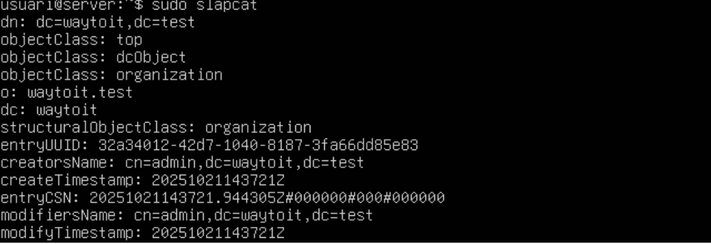
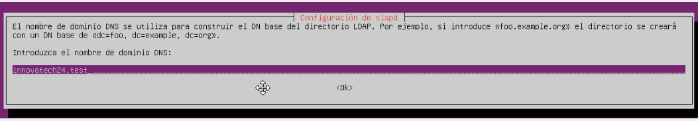
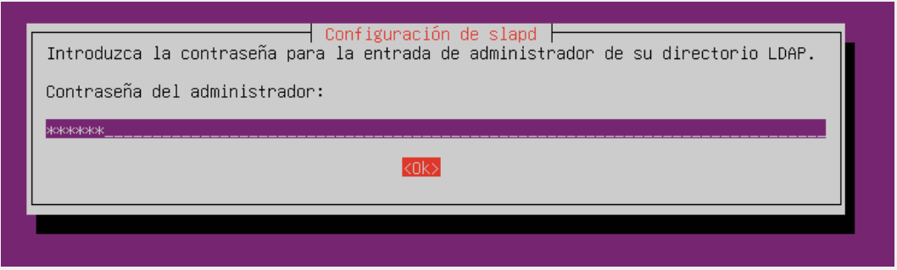
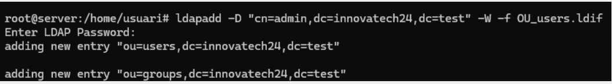
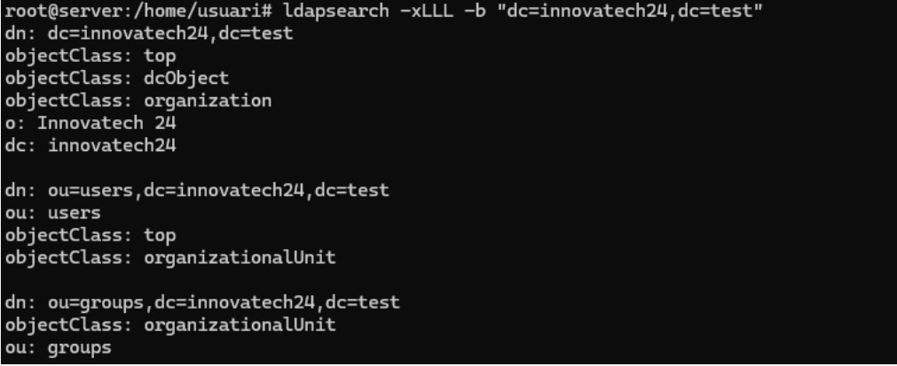

# Tasques d'Implementació i Configuració del Servidor LDAP

| ID         | Descripció de la Tasca                                                | Detalls de la Configuració                                                                                 | Imatge                       |
|------------|----------------------------------------------------------------------|------------------------------------------------------------------------------------------------------------ | ---------------------------- |
| **T.LDAP.01** | Instal·lació del servei OpenLDAP.                                    | S'ha de mostrar el resultat de la comanda `slapcat` per validar la instal·lació base.                    | 
| **T.LDAP.02** | Configuració de la base de dades.                                   | **Nom del Domini:** innovatechXX.test                                                                     | 
| **T.LDAP.03** | Configuració de la contrasenya d'administrador.                     | **Contrasenya:** p@ssw0rd                                                                                 | 
| **T.LDAP.04** | Creació d'Unitats Organitzatives (OU) inicials.                     | S'han de crear dues OUs: **users** i **groups** mitjançant un fitxer `.ldif`.                             | 
| **T.LDAP.05** | Validació de les Unitats Organitzatives.                            | Realitzar una consulta amb `ldapsearch` que mostri totes les OUs creades al directori.                    | 

👉 [Torna al Plec de Condicions Tècniques](https://github.com/PolVallesSMX2/Projecte3-ConsultoriaEverPia2/tree/main/Tasques/T04/Plec%20de%20Condicions%20T%C3%A8cniques)  
📍 [Torna a la pàgina de la tasca](../)
