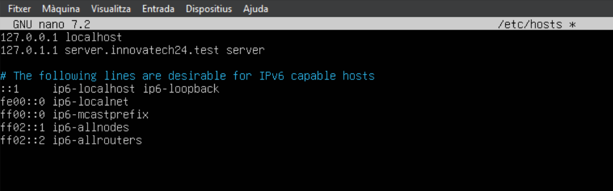
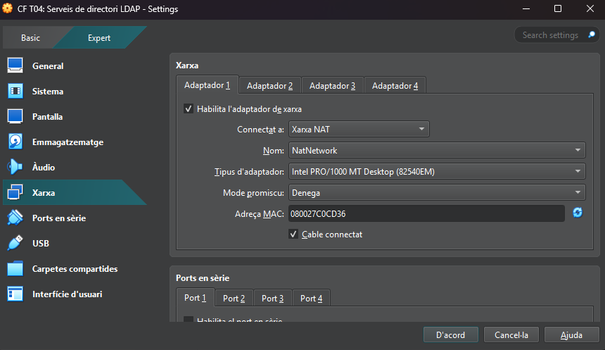

| ID       | Descripció del Requeriment                           | Configuració Requerida                             | Imatge                       |
| -------- | ---------------------------------------------------- | -------------------------------------------------- | ---------------------------- |
| R.INF.01 | Configuració de la màquina Server (Server Hostname). | server.innovatech24.test                           | 
| R.INF.02 | Interfície de Xarxa Pública.                         | NAT(Per accés a Internet i descàrrega de paquets). | 
| R.INF.03 | Interfície de Xarxa Privada.                       | Host-Only (Per a comunicació privada amb el Client virtual  i la màquina física). | 

👉 [Torna al Plec de Condicions Tècniques](https://github.com/PolVallesSMX2/Projecte3-ConsultoriaEverPia2/tree/main/Tasques/T04/Plec%20de%20Condicions%20T%C3%A8cniques)  
📍 [Torna a la pàgina de la tasca](../)
