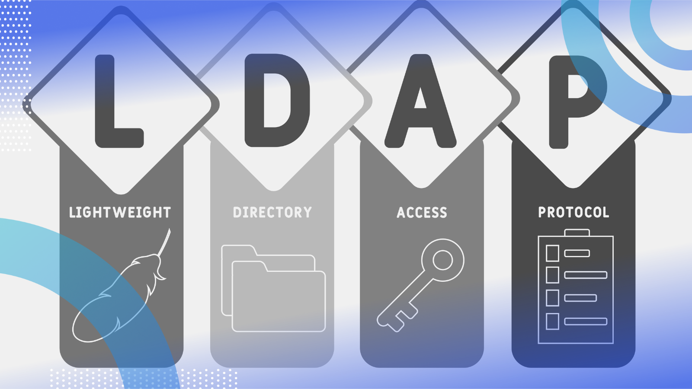

# Guia d'Instal·lació i Configuració de LDAP SLAPD

Autor: Pol Valles Esteban

<br><br>
<div align=center>
  <p><i>En aquesta guía aprendrem a com instal·lar i configurar OpenLDAP</i></p>
  <p><i>En el nostre cas crearem una nova màquina virtual Ubuntu Server, un cop creada i configurada i estiguem a la terminal seguirem aquests passos.</i></p>
</div>
<br>

<div align=center>
  
</div>

## 📰 Contingut

1. Comprovar el nom de servidor i domini i la xarxa  
2. Instal·lació del servei i les seves utilitats  
3. Tasques d’implementació i configuració del servidor LDAP  
4. Implementació del gestor d’usuaris de LDAP → LAM  
5. Gestió i Administració (LAM)  

---

## 👉 Introducció
En aquesta guia aprendrem a com instal·lar i configurar OpenLDAP.  
Crearem una nova màquina virtual Ubuntu Server i seguirem aquests passos des de la terminal.

---

## 1. 🌐 Comprovar el nom de servidor i domini i la xarxa

Editem l'arxiu `/etc/hosts`:  
`sudo nano /etc/hosts`

text
Configurarem el nom del domini.

Per canviar el nom del servidor:
`sudo hostnamectl set-hostname ldap-server-24`

Per verificar el nom i el domini del servidor:
`hostname`
`hostname -f`

Revisar configuració d'adaptadors de xarxa (adaptador1: NAT o pont, adaptador2: host-only):
`ip a`

---

## 2. 🔛 Instal·lació del servei i les seves utilitats

Instal·lem el servidor LDAP i les utilitats:
`sudo apt install slapd lapd ldap-utils -y`

Veure estat del servei slapd:
`systemctl status slapd`

Comprovar que el directori s'ha creat:
`sudo slapcat`

Si no s'ha configurat bé el domini abans de la instal·lació, reconfigurem:
`sudo dpkg-reconfigure slapd`

Durant la configuració es demana:

- Ometre la configuració? **No**
- Nom del domini DNS (exemple: `innovatech24.test`)
- Nom de l'organització (exemple: `Innovatech 24`)
- Contrasenya de l'administrador LDAP
- Esborrar base de dades quan es purgui el paquet? (Sí/No)
- Moure base de dades antiga? (Sí/No)

Revisem els canvis amb:
`sudo slapcat`

---

## 3. ⚖️ Tasques d’implementació i configuració del servidor LDAP

Creem Unitat Organizativa (OU) amb un fitxer `.ldif`:  
```sudo nano OU_users.ldif```

Contingut exemple del fitxer `.ldif` per crear dues OUs:
```
dn: ou=users,dc=innovatech24,dc=test
ou: users
objectClass: top
objectClass: organizationalUnit

dn: ou=groups,dc=innovatech24,dc=test
ou: groups
objectClass: top
objectClass: organizationalUnit
```

Afegim-les al directori:
`ldapadd -D "cn=admin,dc=innovatech24,dc=test" -W -f OU_users.ldif`

Fem una consulta per comprovar que s'han creat:
`ldapsearch -x -LLL -b "dc=innovatech24,dc=test" ou`

Alternativament:
`ldapsearch -xLLL -b "dc=innovatech24,dc=test" objectClass=organizationalUnit`

Per eliminar un OU:
`ldapdelete -D "cn=admin,dc=innovatech24,dc=test" -W "ou=groups,dc=innovatech24,dc=test"`

---

## 4. 🔐 Implementació del gestor d’usuaris de LDAP → LAM

Actualitzem el sistema:
`sudo apt update && sudo apt upgrade`

Instalem LDAP Account Manager (LAM):
`sudo apt install ldap-account-manager -y`

---

## 5. 🚨 Gestió i Administració (LAM)

Accedir al gestor gràfic des de la màquina física amb l'URL:

`http://[IP_del_adaptador_host-only]/lam`

Configuració inicial:

- Perfil d'usuari: `lam`
- Contrasenya per defecte: `lam` (recomanable canviar-la)
- Configurar idioma, comptes i administrador
- Configurar paràmetres LDAP (exemple):

Dirección del servidor*: ldap://localhost:389
Activar TLS: no
Límite de búsqueda LDAP
Parte del DN a ocultar
Método del inicio de sesión
Lista de usuarios válidos: cn=admin,dc=innovatech24,dc=test
Idioma por defecto: Español (España)
Zona horaria: Europe/Madrid

A la pestanya "Tipos de cuentas" configurarem els OUs per usuaris i grups.

---

### Creació de grups de seguretat al directori

Crear dos grups: `tech` i `manager`.

### Creació d'usuaris i assignació a grups

Crear usuaris:
- `tech01` assignat al grup `tech`
- `manager01` assignat al grup `manager`

## 🧩 Altres


### Comandes bàsiques LDAP

- Afegir elements:
`ldapadd -D "cn=admin,dc=innovatech24,dc=test" -W -f fitxer.ldif`

- Buscar dins el directori:
`ldapsearch -x -LLL -b "dc=innovatech24,dc=test" <filtres>`

- Esborrar objectes:
`ldapdelete -D "cn=admin,dc=innovatech24,dc=test" -W "<DN_objet>"`

- Modificar entrada existent:
`ldapmodify -D "cn=admin,dc=innovatech24,dc=test" -W -f modificacions.ldif`

- Canviar contrasenya:
`ldappasswd -D "cn=admin,dc=innovatech24,dc=test" -W`

---

### Notes Addicionals

- LAM és una eina gràfica que facilita la gestió d'usuaris i grups LDAP.

<br><br>
<div align=center>
  <p><b>Fi de la guía</b></p>
  <p>Document escrit per Pol Vallés</p>
</div>


<div align=center>
  <span>📝 </span><a href="README.md">Tornar a la tasca</a><br>
  <span>📍 </span><a href="../../../README.md">Tornar a la pàgina del projecte</a>
</div>
